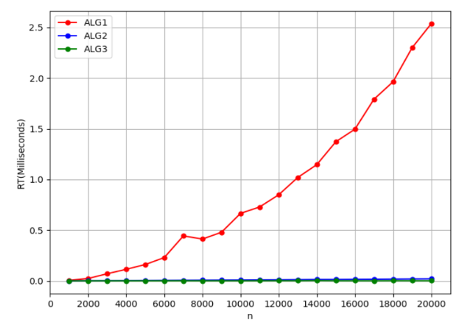
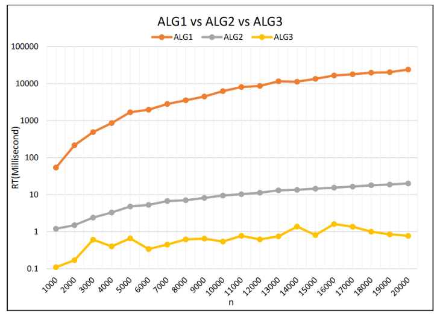

# Algorithm-Programming-Project
This program demonstrates the Selection Problem using the following sorting algorithms: Insertion Sort, HeapSort and Randomized-Select. The program uses an array with 5 indices, each with 20,000 random generated numbers from 0-32767 and runs tests on each index at increaments of 1,000.

In this case, ALG1 is the Insertion Sort, ALG2 is the HeapSort and ALG3 is the Randomized-Select algorithm.

The program will output the following graph for the results:

This graph was created in excel and is a zoomed in version of the first graph:

